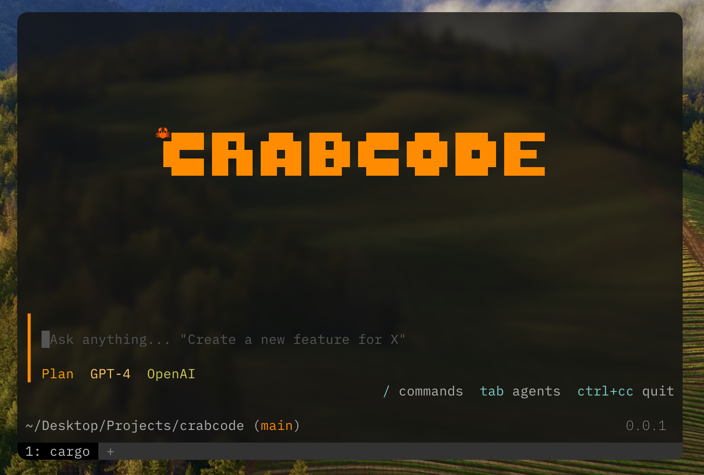

# crabcode

> [!WARNING]  
> This project is very very early (like experiment-early) don't expect it to get to OpenCode level anytime soon.

A purely Rust-based AI CLI coding agent with a beautiful terminal UI for interactive AI-assisted development.



## Features

- **Built for the OpenCode user** - works out of the box w/ opencode themes, every UX from opencode carefully ported into rust.
- **Opens literally instantly** - one of my main motivations why I made this, rust! :D Very lightweight after build.
- **Terminal UI (TUI)** - Beautiful, responsive interface built with [ratatui](https://github.com/ratatui-org/ratatui)
- **Agent System** - Switch between PLAN (read-only analysis) and BUILD (implementation) agents with TAB
- **Multiple Model Support** - Works with nano-gpt, z.ai, and other AI models via HTTP APIs
- **Command System** - Intuitive commands: `/sessions`, `/new`, `/connect`, `/models`, `/exit`
- **Auto-suggestions** - Get suggestions for commands when typing `/`
- **Status Bar** - Shows version, current directory, git branch, active agent, and model
- **Session Management** - Create and manage multiple chat sessions
- **Streaming Responses** - Real-time streaming of AI responses
- **Git Integration** - Detects and displays current git branch
- **Config Management** - Secure API key storage in `~/.config/crabcode/api_keys.json`

## Installation

Install via cargo:

```bash
cargo install crabcode
```

## Quick Start

1. Run crabcode:

   ```bash
   crabcode
   ```

2. Configure your AI model:

   ```
   /connect
   ```

3. Start coding! Type your questions or requests and press Enter.

## Usage

### Commands

| Command               | Description                                     |
| --------------------- | ----------------------------------------------- |
| `/sessions`           | List all sessions                               |
| `/new [name]`         | Create a new session                            |
| `/connect <provider>` | Configure model provider (e.g., nano-gpt, z.ai) |
| `/models`             | List available models                           |
| `/exit`               | Quit crabcode                                   |

### Key Bindings

| Key              | Action                                 |
| ---------------- | -------------------------------------- |
| `TAB`            | Switch between PLAN and BUILD agents   |
| `Enter`          | Submit message or execute command      |
| `Ctrl+C` (once)  | Clear input                            |
| `Ctrl+C` (twice) | Quit                                   |
| `Esc`            | Close popup suggestions                |
| `↑/↓`            | Navigate in input or suggestions popup |

### Agent Types

- **PLAN** - Read-only analysis and planning agent. Best for understanding codebases, architecture questions, and planning changes.
- **BUILD** - Full access implementation agent. Best for writing code, implementing features, and making changes.

## Configuration

API keys are stored securely in `~/.config/crabcode/api_keys.json`.

### Supported Providers

These are my priority. Will be powered by mostly [aisdk](https://github.com/lazy-hq/aisdk) + [models.dev](https://models.dev)

- [ ] **nano-gpt** - NanoGPT API
- [ ] **z.ai** - z.ai coding plan
- [ ] **minimax.io**

## Development

### Build from source

```bash
git clone https://github.com/blankeos/crabcode.git
cd crabcode
cargo build --release
```

### Run tests

```bash
cargo test
```

## Contributing

Contributions are welcome! Please feel free to submit a Pull Request.

## License

This project is licensed under the MIT License - see the [LICENSE](LICENSE) file for details.

## Inspiration

This project was inspired by [anomalyco/opencode](https://github.com/anomalyco/opencode).

## Scope

- Chat, switch models, agents
- Minimal configurations (I want it to just feel at least like vanilla opencode)
- The cheapest model providers (GLM, etc.)
- A ding sound, my only opencode plugin at the moment.
- No reverse-engineering oauth from big AI (Codex, Claude Code, Gemini), at least for now (Don't wanna get in trouble).
- Possibly ralphy? (very far, idk how to do that)
- ACP? (very far, idk how to do that)
- No plugin ecosystem
- No desktop app
- No web sharing thing

## Why?

I'm learning rust :D. Built a few TUIs as practice. Also been making AI chat apps on web, so I wanna work on this.

## Repository

[https://github.com/blankeos/crabcode](https://github.com/blankeos/crabcode)
