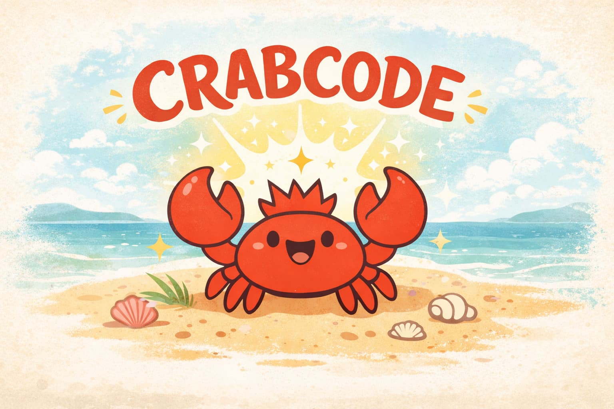

# 🦀 crabcode

A purely Rust-based AI CLI coding agent with a beautiful terminal UI for interactive "agentic engineering".

> In the words of the buildwithpi.ai creators, 'There are many coding agents, this one is mine'.
>
> It's OpenCode but in pure Rust 🦀 w/ my personal flavors.
>
> ~ Carlo (Author)



## Features

- **Made with Rust** - Uses ratatui, crossterm and nucleo (fuzzy search), all fast tech.
- **Notifications** - Sounds, desktop notifications, and terminal alert signals are built in.
- **TPS, TTFT, Latency metrics** - Also wanted this in opencode, just made it built-in.
- **Opens instantly** - one of my main motivations why I made this! :D Very lightweight after build.
- **Terminal UI (TUI)** - Beautiful, responsive interface built with [ratatui](https://github.com/ratatui-org/ratatui)
- **Built for the OpenCode user** - works out of the box w/ opencode themes, every UX, and some existing configs so you don't need to force your team to use crabcode.
  - **Same UX** - carefully ported most of the good UX from OpenCode i.e. shortcuts, etc.
  - **Agent System** - Switch between PLAN (read-only analysis) and BUILD (implementation) agents with TAB, and custom agents.
  - **Multiple Model Support** - Works w/ the same models.dev support.
  - **Command System** - Intuitive commands: `/sessions`, `/new`, `/connect`, `/models`, `/exit` + custom commands.
  - **Session Management** - Create and manage multiple chat sessions
  - **Streaming Responses** - Real-time streaming of AI responses (w/ [aisdk.rs](https://aisdk.rs))

## Installation

```sh
npm install -g crabcode  # npm
bun install -g crabcode  # or bun
cargo binstall crabcode  # or cargo-binstall (prebuilt binary, faster)
cargo install crabcode   # or cargo (build from source)
curl -sSL https://raw.githubusercontent.com/Blankeos/crabcode/main/install.sh | sh # or linux/macos (via curl)
```

## Quick Start

1. Run crabcode:

   ```bash
   crabcode
   ```

2. Configure your AI model:

   ```
   /connect
   ```

3. Start coding! Type your questions or requests and press Enter.

## Usage

### Commands

| Command     | Description                      |
| ----------- | -------------------------------- |
| `/sessions` | List all sessions                |
| `/new`      | Create a new session             |
| `/connect`  | Open the provider connect dialog |
| `/models`   | List available models            |
| `/exit`     | Quit crabcode                    |

### Key Bindings

| Key              | Action                                 |
| ---------------- | -------------------------------------- |
| `Ctrl+X`         | Open the shortcuts dialog              |
| `TAB`            | Switch between PLAN and BUILD agents   |
| `Enter`          | Submit message or execute command      |
| `Ctrl+C` (once)  | Clear input                            |
| `Ctrl+C` (twice) | Quit                                   |
| `Esc`            | Close popup suggestions                |
| `↑/↓`            | Navigate in input or suggestions popup |

### Agent Types

- **PLAN** - Read-only analysis and planning agent. Best for understanding codebases, architecture questions, and planning changes.
- **BUILD** - Full access implementation agent. Best for writing code, implementing features, and making changes.

## Configuration

Your credentials are stored in crabcode's state directory:

- Default: `~/.local/state/crabcode/auth.json`
- With `XDG_STATE_HOME`: `$XDG_STATE_HOME/crabcode/auth.json`

Read the [configuration docs here](/_docs/config/index.mdx).

### Supported Providers

> Will be powered by mostly [aisdk](https://github.com/lazy-hq/aisdk) + [models.dev](https://models.dev)
> So **most of them** will work out of the box.

I tried crabcode specifically for these providers:

- [x] **openai** (both API key and OAuth, thank you OpenAI for supporting harnesses!)
- [x] **opencode-zen** and **opencode-go**
- [x] **nano-gpt**
- [x] **zai**
- [x] **ollama-cloud**
- [x] **xiaomi-token-plan-sgp**
- [x] **minimax**
- [x] **fireworks**
- [x] **baseten**

> Feel free to create an issue / add to this list if you tried

### Known unsupported providers

> I might work harder to support these in the future.

- Kimi For Coding Subscription - I keep getting 401 but it works in OpenCode, I may have to contact them first. **might support later**
- Gemini - It's OAuth + also very unsure. So currently no.
- Claude Code Subscription - Known to explicitly not like harnesses. So never will, sorry.

## Development

### Run tests

```bash
cargo test
```

## Contributing

Contributions are welcome! Please feel free to submit a Pull Request.

## License

This project is licensed under the MIT License - see the [LICENSE](LICENSE) file for details.

## Inspiration

This project was inspired by [anomalyco/opencode](https://github.com/anomalyco/opencode). Also made this project w/ OpenCode btw, so thank you OpenCode! 🙏

## Scope and Limits

- [x] Chat, switch models, agents
- [x] Minimal configurations (I want it to just feel at least like vanilla opencode)
- [x] The cheapest model providers (GLM, etc.)
- [x] A ding sound, my only opencode plugin at the moment.
- [x] No reverse-engineering oauth from big AI (Claude Code, Gemini), at least for now (Don't wanna get in trouble).
- [x] Exception: ChatGPT oauth (because I use it)
- [x] Copy chat contents, copy the chat input
- [x] Image inputs
- [x] Personal remote usage + Browser client equivalent.
- [ ] ACP w/ Zed? (very far, idk how to do that)
- [x] No Claude Code oauth spoofing.
- [x] No plugin ecosystem (If I think it's worth building, just make it built-in and configurable i.e. sounds)
- [x] No desktop app

## Why?

I'm learning rust :D. Built a few TUIs as practice. Also been making AI chat apps on web, so I wanna work on this.
